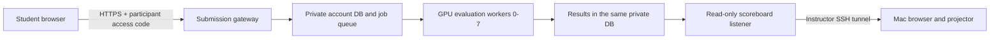

# Students, judge host and instructor Mac

## Proposed event topology (not deployed)



Use one administrator-owned host with eight GPUs for the current SQLite queue.
Eight independent VMs require a different queue/worker transport; a shared
SQLite network mount is not supported. Students' individual GPU machines are
for practice, not trusted score reporting.

The Mac is a viewer, not the submission server. Closing it or losing its tunnel
does not stop grading processes that are supervised on the remote host. If the
host or unsupervised processes stop, grading stops too; process supervision and
backups remain deployment work.

## Instructor-only viewing

After the read-only listener is running on remote port 8091, run on the Mac:

```bash
brev port-forward YOUR_JUDGE_INSTANCE --port 8091:8091
```

Replace `YOUR_JUDGE_INSTANCE` with the real instance name. Keep this process
running and open `http://127.0.0.1:8091/display` on the Mac. If local port 8091 is
busy, forward `8092:8091` and open local port 8092 instead.

The underlying SSH alternative, using the alias generated by Brev, is:

```bash
ssh -N -o ExitOnForwardFailure=yes -o ServerAliveInterval=30 -o ServerAliveCountMax=3 -L 127.0.0.1:8091:127.0.0.1:8091 YOUR_JUDGE_INSTANCE
```

Keepalives detect a dead connection; they do not guarantee automatic reconnection
after sleep or a network change. Reconnect the tunnel and refresh the display.
Do not change the local binding to `0.0.0.0` or publish the viewer port.

Brev documents SSH TCP forwarding with `local:remote` port mappings:
[NVIDIA Brev connectivity](https://docs.nvidia.com/brev/cli/connectivity).

## Student connection

The event needs one stable HTTPS submission URL reachable by all 110 student
browsers. Students sign in with their judge access code and upload their saved
exercise code. They do not SSH into the administrator's GPU host.

A reviewed TLS gateway can front the submission service, while the read-only
8091 listener stays reachable only through the instructor tunnel. However,
the current pilot explicitly validates loopback Host/Origin and uses a local
development HTTP server. Adding a reverse proxy alone is **not** a complete or
tested public deployment. Do not disable these checks to make a tunnel work.
Implement explicit trusted origins, production serving, authentication limits,
request/resource quotas and disposable restricted workers before public use.

Brev offers tunnel URLs and authenticated Secure Links, but their audience and
access settings must be checked for the event. They do not automatically create
judge accounts or replace application authentication. Never grant students
administrative SSH permissions just to access the submission form.
[Connectivity](https://docs.nvidia.com/brev/cli/connectivity),
[Launchable network controls](https://docs.nvidia.com/brev/concepts/launchables).

## Accounts and submitted data

1. The instructor assigns a unique public alias, such as `participant-001`.
2. `add-participant participant-001` creates an internal ID and random access
   code. Only its hash is stored; the code is printed once for private delivery.
3. The participant enters that access code on the submission page. It is a
   bearer credential, not an OTP or a Brev password. Current pilot codes remain
   valid for the scoring state; expiry, rotation and revocation are not built.
4. The upload contains a Challenge number and exercise source files. The API
   attaches the authenticated internal ID and creates an immutable job.
5. A GPU worker validates the allowed exercise functions, trains with frozen
   settings and records server-computed scores. Local score files are ignored.
6. The participant sees their job details; the projector shows public aliases,
   per-Challenge best submission scores and the provisional total only.

Issuance currently uses one CLI command per participant. Bulk roster import,
private distribution, recovery/rotation, submission deadlines and event-level
operator controls are outstanding work. Do not email one shared access code or
publish a 110-person credential CSV in this repository.

## Before opening submissions

- Confirm the actual one-host/eight-GPU topology and benchmark all Levels.
- Decide the hostname, reachable network, TLS and allowed student audience.
- Complete account lifecycle, operational quotas, deadlines and retention policy.
- Run all untrusted work in restricted disposable worker environments, not on a
  company desktop. The restricted AST interpreter is not a general Python sandbox.
- Rehearse 110 participants, duplicate retries, GPU/process failures and recovery.
- Keep private state on persistent local disk with restricted permissions and
  tested backups. GitHub is neither the score database nor its backup destination.
