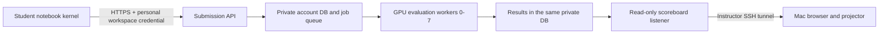

# Students, judge host and instructor Mac

## Proposed event topology (not deployed)

The complete student-facing topology below is still pending. The source
repository and local integration tests do not prove that an administrator's
private deployment is running this version. Verify the deployed course/judge
revisions, accounts, worker processes and network ingress before an event.



Use one administrator-owned host with eight GPUs for the current SQLite queue.
Eight independent VMs require a different queue/worker transport; a shared
SQLite network mount is not supported. Students' individual GPU machines are
for practice, not trusted score reporting.

The Mac is a viewer, not the submission server. Closing it or losing its tunnel
does not stop grading processes if they are independently supervised on the
remote host. Process supervision and tested backups are deployment requirements;
stopping the VM still stops grading.

## Instructor-only viewing

After the read-only listener is running on remote port 8091, run on the Mac:

```bash
brev port-forward YOUR_JUDGE_INSTANCE --port 8091:8091
```

Replace `YOUR_JUDGE_INSTANCE` with the real instance name. Keep this process
running and open `http://127.0.0.1:8091/display` on the Mac. Keep both ports at
8091: the pilot checks the HTTP Host port, so `8092:8091` is not supported and
returns 403. If local port 8091 is busy, check whether the intended tunnel is
already running; do not start a second tunnel or stop an unrelated process.

The underlying SSH alternative, using the alias generated by Brev, is:

```bash
ssh -N -o ExitOnForwardFailure=yes -o ServerAliveInterval=30 -o ServerAliveCountMax=3 -L 127.0.0.1:8091:127.0.0.1:8091 YOUR_JUDGE_INSTANCE
```

Keepalives detect a dead connection; they do not guarantee automatic reconnection
after sleep or a network change. Reconnect the tunnel and refresh the display.
Do not change the local binding to `0.0.0.0` or publish the viewer port.

Brev documents SSH TCP forwarding with `local:remote` port mappings:
[NVIDIA Brev connectivity](https://docs.nvidia.com/brev/cli/connectivity).

## Student connection

The event needs one stable HTTPS API URL reachable by all 110 student instances.
Students save their exercise files and click **Submit code** inside the notebook.
The notebook's Python kernel authenticates with a private per-participant key,
sends only the exercise functions and polls personal results. No separate judge
login, file download or website upload is required. Students do not SSH into the
administrator's GPU host. The projector only reads standings.

A reviewed TLS gateway can front the submission service, while the read-only
8091 listener stays reachable only through the instructor tunnel. However,
the current pilot explicitly validates loopback Host/Origin and uses a local
development HTTP server. Adding a reverse proxy alone is **not** a complete or
tested public deployment. Do not disable these checks to make a tunnel work.
Implement explicit trusted origins, production serving, authentication limits,
request/resource quotas and disposable restricted workers before public use.

Brev offers tunnel URLs and authenticated Secure Links, but their audience and
access settings must be checked for the event. They do not automatically create
judge accounts or replace application authentication. Never grant students
administrative SSH permissions to connect their notebooks. A browser-authenticated
Secure Link can redirect a Python request to a login page; use an API ingress
that accepts the participant credential without browser redirects.
[Connectivity](https://docs.nvidia.com/brev/cli/connectivity),
[Launchable network controls](https://docs.nvidia.com/brev/concepts/launchables).

## Accounts and submitted data

1. The instructor provisions one personal judge account per participant.
   `add-participant` without a name creates an unnamed account, not a random nickname.
2. The command creates an internal ID and random access code. Only its hash is
   stored; the code is printed once for private delivery. An optional display
   name can still be supplied by the instructor.
3. Provision that credential privately into the participant's workspace, outside
   the notebook and served checkout. It is a bearer credential, not an OTP or a
   Brev password. Current pilot codes remain
   valid for the scoring state; expiry, rotation and revocation are not built.
4. In the notebook submission panel, the participant enters **Nickname** and clicks
   **Register nickname**. The authenticated profile endpoint saves that name to
   their own account. It is reused in all four Challenges. Brev names are not
   fetched automatically. Only then can **Submit code** send the Challenge number
   and exercise functions; the API attaches the authenticated internal ID.
5. A GPU worker validates the allowed exercise functions, trains with frozen
   settings and records server-computed scores. Local score files are ignored.
6. The participant sees job details in the notebook. The projector shows only
   the selected Challenge: rank, registered display name and best submission
   score. Other Challenges and the overall total do not appear on the screen.

Without a valid personal credential, submission is rejected. The server does
not accept anonymous submissions or a display name supplied with the code.

Issuance currently uses one CLI command per participant. Bulk roster import,
verified mapping from Brev users to judge accounts, private provisioning,
recovery/rotation, submission deadlines and event-level operator controls are
outstanding work. Do not use a shared credential in a Launchable or publish a
110-person credential CSV in this repository.

## Launchable connection hook

The updated course provides `ETC.runtime.judge_client` and notebook controls for
all four Challenges. When an operator has already provisioned a personal
`AI4SCI_JUDGE_TOKEN` and `AI4SCI_JUDGE_URL` into a private setup environment,
running `python -m ETC.runtime.judge_client` from the course root persists them
to the Jupyter user's `~/.config/ai4sci/judge.json` with mode 600. Serve only the
course directory, not the user's home. The hook refuses to overwrite existing
configuration and never prints the key. The notebook reads the file after
restart, without asking the student to log in again.

This hook is not Brev SSO and does not create an account. A shared Launchable
alone does not identify the student: a trusted per-user provisioning step is
still required. An instance name or a typed email is not identity proof. The
client checks HTTPS, refuses credential-bearing URLs and authentication redirects,
and sends the key only in an Authorization header. HTTP is permitted only for
loopback rehearsal. It never automatically retries POST requests. The server
deduplicates identical queued/running/completed submissions.

## Before opening submissions

- Confirm the actual one-host/eight-GPU topology and benchmark all Levels.
- Decide the hostname, reachable network, TLS and allowed student audience.
- Complete account lifecycle, operational quotas, deadlines and retention policy.
- Run all untrusted work in restricted disposable worker environments, not on a
  company desktop. The restricted AST interpreter is not a general Python sandbox.
- Rehearse 110 participants, duplicate retries, GPU/process failures and recovery.
- Keep private state on persistent local disk with restricted permissions and
  tested backups. GitHub is neither the score database nor its backup destination.
